# Server-Side Data Processing for IoT Fingerprint Attendance System
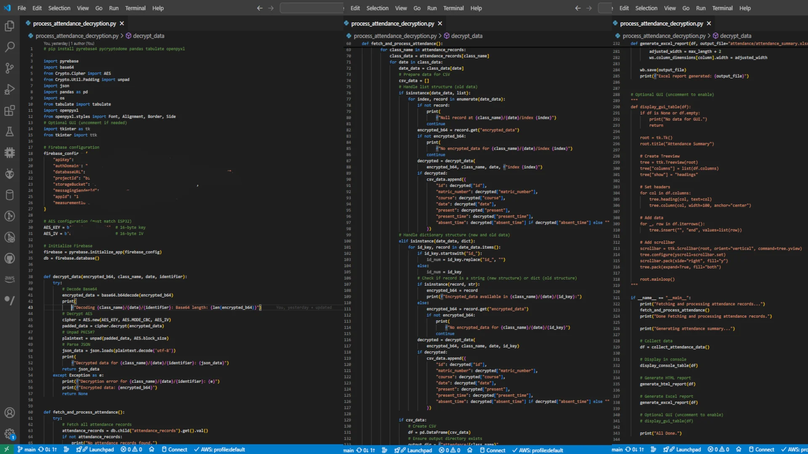

A Python-based server-side script for processing encrypted attendance data from an IoT fingerprint system, designed for educational institutions. Integrated with Firebase Realtime Database, it decrypts AES-128 records, generates CSV, HTML, and Excel reports, and enables Heads of Department (HODs) to review attendance post-lecture. This script complements the embedded system, available at [EMBEDDED-An-IoT-Based-Fingerprint-Attendance-System-for-Educational-Institutions](https://github.com/damilarelekanadekeye/EMBEDDED-An-IoT-Based-Fingerprint-Attendance-System-for-Educational-Institutions).

[](https://opensource.org/licenses/MIT)
[](https://www.python.org/)
[](https://firebase.google.com/)
[](https://pandas.pydata.org/)

## Table of Contents
- [Overview](#overview)
- [Features](#features)
- [Software Requirements](#software-requirements)
- [Setup Instructions](#setup-instructions)
- [Usage](#usage)
- [Data Processing Workflow](#data-processing-workflow)
- [Screenshots](#screenshots)
- [Related Project](#related-project)
- [Contributing](#contributing)
- [License](#license)
- [Contact](#contact)

## Overview
This repository hosts a server-side Python script (`process_attendance_decryption.py`) that processes encrypted attendance data from an IoT-based fingerprint system. Designed for educational institutions, it retrieves data from Firebase, decrypts it using AES-128, and generates structured reports (CSV, HTML, Excel) for administrators, such as HODs, to review attendance after lectures. The script ensures security, scalability, and automation, complementing the hardware system developed in the [EMBEDDED-An-IoT-Based-Fingerprint-Attendance-System-for-Educational-Institutions](https://github.com/damilarelekanadekeye/EMBEDDED-An-IoT-Based-Fingerprint-Attendance-System-for-Educational-Institutions) repository.

## Features
- **Secure Decryption**: Decrypts AES-128 (CBC mode) Base64-encoded data with PKCS#7 padding.
- **Real-Time Data Access**: Fetches records from Firebase under `/attendance_records/`.
- **Multi-Format Reports**: Generates CSV files per class/date, styled HTML tables, and formatted Excel spreadsheets.
- **Flexible Data Handling**: Supports both list and dictionary Firebase data structures.
- **Error Management**: Logs decryption failures and skips malformed records.
- **Automation**: Streamlines report generation for HODs, enabling post-lecture attendance reviews.
- **Scalability**: Optimized for large datasets using Pandas.

## Software Requirements
- Python 3.8+
- Libraries: `pyrebase`, `pycryptodome`, `pandas`, `tabulate`, `openpyxl`
- Firebase Realtime Database account
- Visual Studio Code or any Python IDE

## Setup Instructions

### 1. **Clone the Repository**:
```bash
git clone https://github.com/damilarelekanadekeye/SOFTWARE-A-Server-side-Fingerprint-Attendance-System-For-Educational-Institutions.git
cd SOFTWARE-A-Server-side-Fingerprint-Attendance-System-For-Educational-Institutions
```

### 2. **Install Dependencies**:
```bash
pip install pyrebase pycryptodome pandas tabulate openpyxl
```

### 3. **Configure Firebase**:
- Create a Firebase project and enable Realtime Database.
- Obtain your Firebase configuration (API key, database URL, etc.).
- Update `src/process_attendance_decryption.py` with your credentials (sample below with redacted values):

```python
firebaseConfig = {
    "apiKey": "********",
    "authDomain": "********",
    "databaseURL": "********",
    "projectId": "********",
    "storageBucket": "********",
    "messagingSenderId": "********",
    "appId": "********"
}
```

### 4. **Set AES Credentials**:
- Use the same 16-byte AES key and IV as the embedded system (redacted here for security):

```python
AES_KEY = b"********"
AES_IV = b"********"
```

- Ensure these match the values in the embedded system repository.

### 5. **Run the Script**:
```bash
python src/process_attendance_decryption.py
```

### 6. **Link to Embedded System**:
- Ensure the IoT fingerprint system is operational to generate attendance data. Refer to the embedded system repository for ESP32 firmware setup.

## Usage

### 1. **Run Post-Lecture**:
- Execute the script after lectures to fetch and process attendance data:

```bash
python src/process_attendance_decryption.py
```

- Reports are saved in `attendance/<className>/<date>.csv`, `attendance/attendance_report.html`, and `attendance/attendance_summary.xlsx`.

### 2. **Access Reports**:
- Open CSV files for class-specific data.
- View `attendance_report.html` in a browser for styled tables.
- Use `attendance_summary.xlsx` for formatted Excel reports.
- Share reports with HODs via email or a shared drive.

## Data Processing Workflow
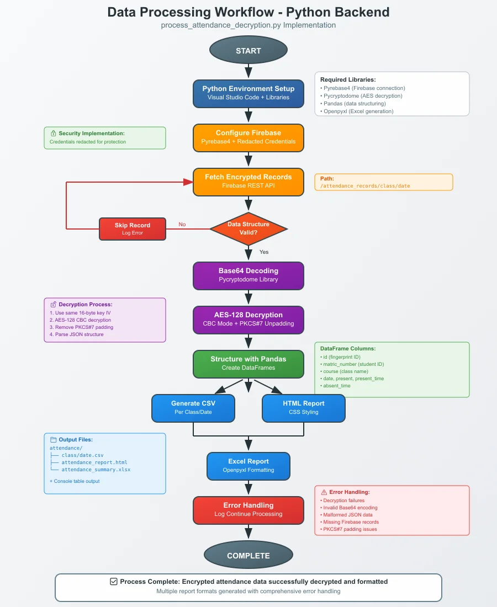

The script follows a streamlined workflow to generate reports for HODs:

1. **Fetch encrypted records from Firebase** (`/attendance_records/`).
2. **Decode Base64 and decrypt using AES-128** with PKCS#7 unpadding.
3. **Validate data; log errors for invalid records**.
4. **Structure data into Pandas DataFrames by class and date**.
5. **Generate CSV files in** `attendance/<className>/<date>.csv`.
6. **Create styled HTML report** (`attendance_report.html`).
7. **Produce formatted Excel report** (`attendance_summary.xlsx`).
8. **Output console table for verification**.

## Screenshots

### Firebase RTDB Report
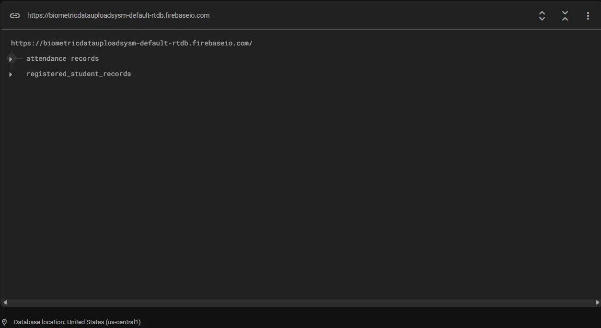
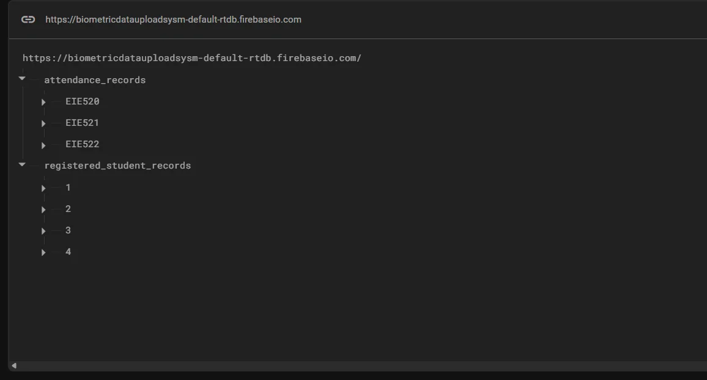
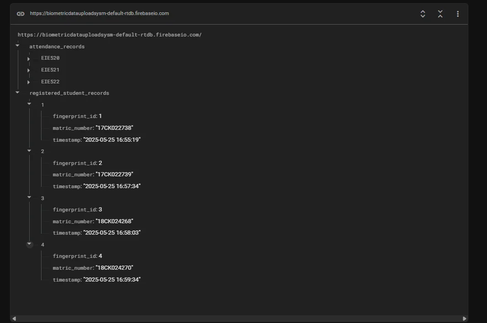
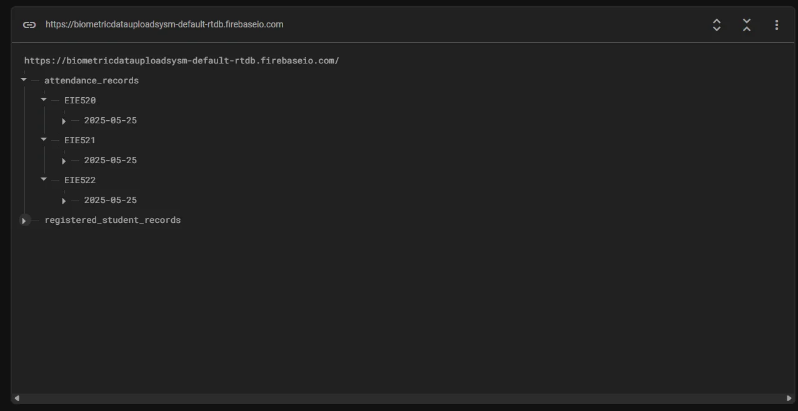
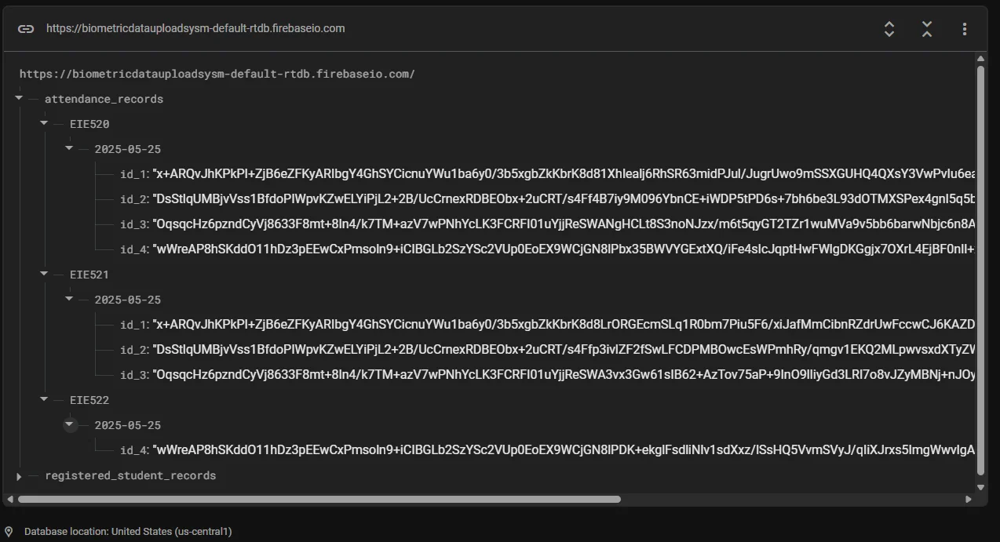

### CSV Report
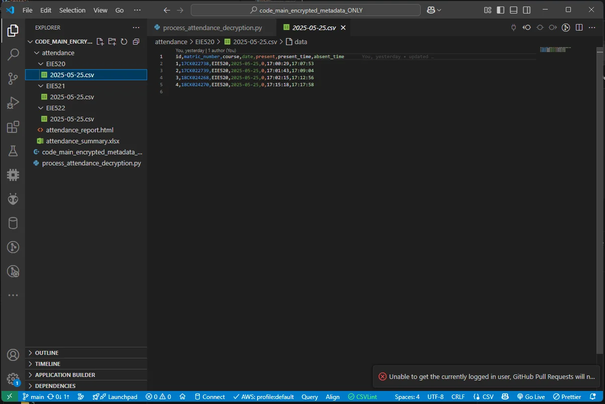
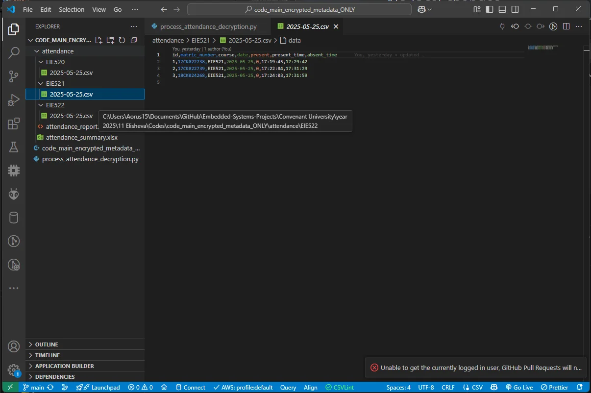
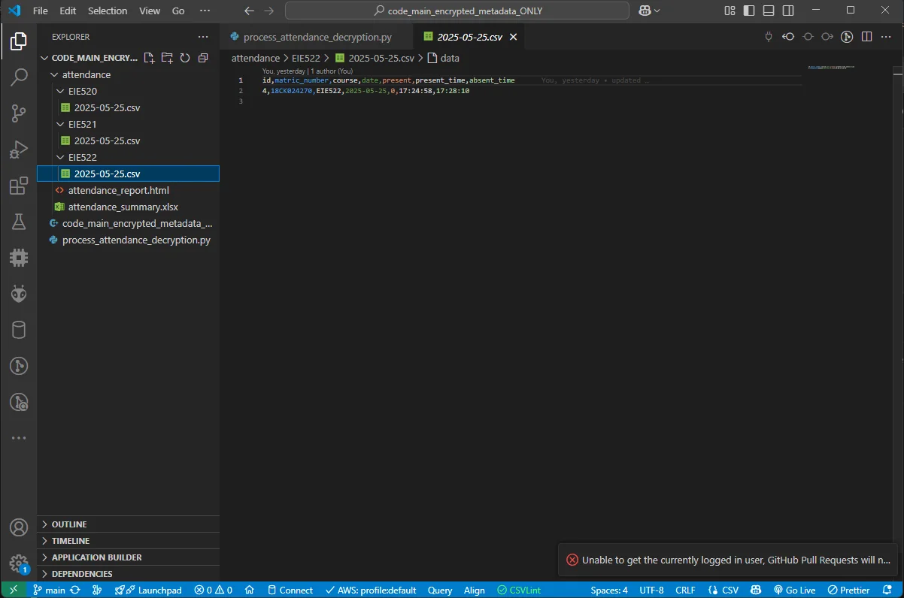

### HTML Report
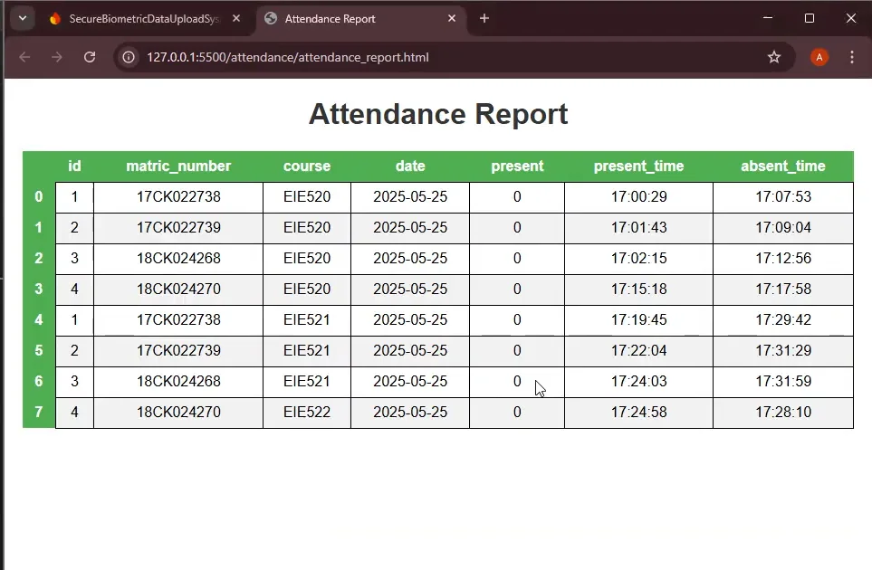

### Excel Report


## Related Project
This server-side script is part of a larger IoT-based fingerprint attendance system. The hardware component, built with ESP32 and AS608 fingerprint sensor, captures and encrypts attendance data. Explore the embedded system at:

- [EMBEDDED-An-IoT-Based-Fingerprint-Attendance-System-for-Educational-Institutions](https://github.com/damilarelekanadekeye/EMBEDDED-An-IoT-Based-Fingerprint-Attendance-System-for-Educational-Institutions)

## Contributing
Contributions are welcome! Please follow these steps:
1. Fork the repository
2. Create a feature branch (`git checkout -b feature/AmazingFeature`)
3. Commit your changes (`git commit -m 'Add some AmazingFeature'`)
4. Push to the branch (`git push origin feature/AmazingFeature`)
5. Open a Pull Request

## License
This project is licensed under the MIT License - see the [LICENSE](LICENSE) file for details.

## Contact
- **Author**: Damilare Lekan Adekeye
- **Portfolio**: [https://damilarelekanadekeye.github.io](https://damilarelekanadekeye.github.io)
- **Email**: [adekeyedamilarelekan@gmail.com](mailto:adekeyedamilarelekan@gmail.com)
- **GitHub**: [https://github.com/damilarelekanadekeye](https://github.com/damilarelekanadekeye)

---
Built with ❤️ for educational efficiency.

## Repository Structure
```
server-side-fingerprint-attendance-system/
├── src/
│   └── process_attendance_decryption.py # Python script with redacted credentials
├── images/
│   ├── banner.webp # Project banner (e.g., Python code or reports)
│   ├── workflow-thumb.webp # Data processing workflow diagram
│   ├── firebase-pic1.webp # Sample Firebase Result screenshot
│   ├── firebase-pic2.webp # Sample Firebase Result screenshot
│   ├── firebase-pic3.webp # Sample Firebase Result screenshot
│   ├── firebase-pic4.webp # Sample Firebase Result screenshot
│   ├── firebase-pic5.webp # Sample Firebase Result screenshot
│   ├── EIE520-CSV.webp # Sample CSV report screenshot
│   ├── EIE521-CSV.webp # Sample CSV report screenshot
│   ├── EIE522-CSV.webp # Sample CSV report screenshot
│   ├── html-result.webp # Sample HTML report screenshot
│   └── excel-report1.webp # Sample Excel report screenshot
├── LICENSE # MIT License file
└── README.md # Main README
```
